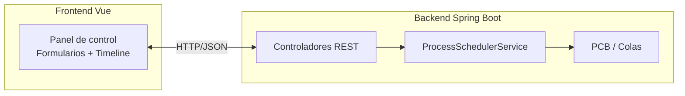
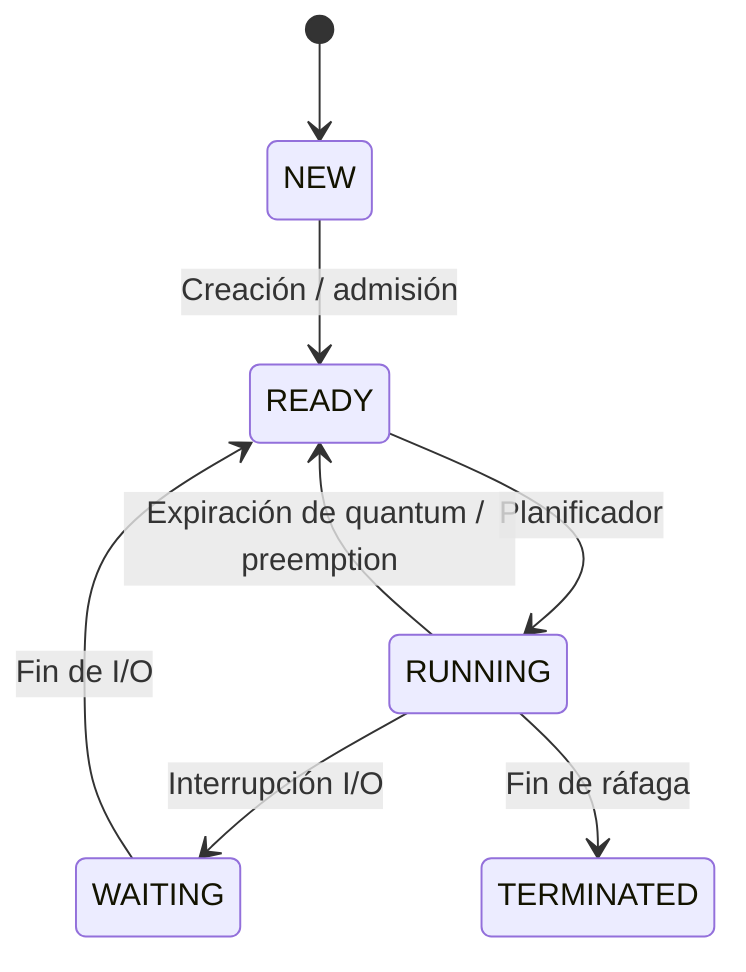

## Simulador Educativo de Sistema Operativo

Proyecto completo (backend Spring Boot + frontend Vite/Vue) para explicar los conceptos principales de un SO: PCB, colas de procesos, algoritmos de planificación, interrupciones y visualización de timeline.

### Arquitectura General



### Backend (Java 17 + Spring Boot 3.3)

- `ProcessControlBlock`, `ProcessState`, `SchedulerAlgorithm`, `InterruptionType`.
- `ProcessSchedulerService` mantiene tabla de procesos, colas ready/waiting/terminated, timeline y estado de simulación. Implementa FCFS, Round Robin (quantum configurable), Prioridad y SJF.
- Controladores REST (`/api/processes`, `/api/simulation`, `/api/interruptions`) + configuración CORS.
- Endpoints principales:
  - `POST /api/processes` crear proceso.
  - `GET /api/processes` listar PCBs.
  - `POST /api/simulation/start|pause|resume|stop`.
  - `GET /api/simulation/state` colas y estado del sistema.
  - `GET /api/simulation/timeline` Gantt.
  - `POST /api/interruptions` emitir interrupciones (I/O, expiración, pausa/detención manual).

### Frontend (Vite + Vue 3)

- Componentes: `ProcessForm`, `ProcessTable`, `QueuesPanel`, `TimelineChart`, `ControlPanel`, `InterruptionPanel`.
- Servicio `osApi` centraliza llamadas REST.
- UI refresca información cada 4 s y permite:
  - Crear procesos y ver PCBs.
  - Seleccionar algoritmo/quantum e iniciar/pausar/detener simulaciones.
  - Emitir interrupciones manuales.
  - Visualizar colas y timeline estilo Gantt.

### Guía de uso

1. **Backend**
   ```bash
   cd backend
   mvn spring-boot:run
   ```
   El API queda disponible en `http://localhost:8080/api`.

2. **Frontend**
   ```bash
   cd frontend
   npm install   # ya ejecutado, repetir si es necesario
   npm run dev
   ```
   Abrir `http://localhost:5173`.

3. **Flujo sugerido**
   - Crear varios procesos (diferentes llegadas, ráfagas y prioridades).
   - Elegir algoritmo y quantum (si aplica) en el panel de control.
   - Iniciar simulación → revisar timeline y colas.
   - Emitir interrupciones para mover procesos entre colas y mostrar cambios de estado.

### Diagrama de Planificación



### Notas

- El simulador es determinista; todas las ejecuciones se realizan en memoria, ideal para laboratorios básicos/intermedios.
- El timeline se recalcula en cada simulación, pero las interrupciones pueden alterar los estados de los PCBs en cualquier momento.
- `application.properties` fija el puerto 8080 y `WebConfig` permite CORS desde Vite (`5173`).
