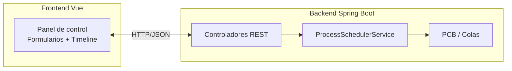
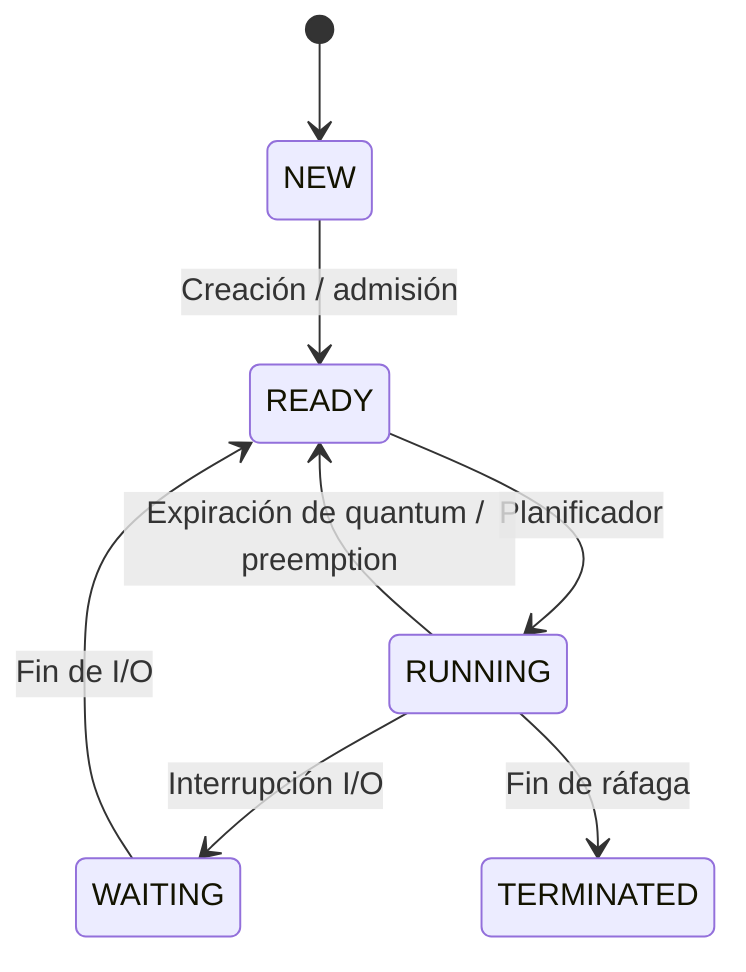

## Simulador Educativo de Sistema Operativo

Proyecto completo (backend Spring Boot + frontend Vite/Vue) para explicar los conceptos principales de un SO: PCB, colas de procesos, algoritmos de planificación, gestión de memoria, interrupciones y visualización de timeline.

### Arquitectura General



### Backend (Java 17 + Spring Boot 3.3)

- `ProcessControlBlock`, `ProcessState`, `SchedulerAlgorithm`, `InterruptionType`, `MemoryBlock`, `MemoryAllocationAlgorithm`.
- `ProcessSchedulerService` mantiene tabla de procesos, colas ready/waiting/terminated, timeline y estado de simulación. Implementa FCFS, Round Robin (quantum configurable), Prioridad y SJF.
- `MemoryManagerService` gestiona asignación de memoria con 4 algoritmos: First Fit, Best Fit, Worst Fit y Segmentación. Calcula fragmentación interna/externa y mantiene estado de bloques de memoria.
- Controladores REST (`/api/processes`, `/api/simulation`, `/api/interruptions`, `/api/memory`) + configuración CORS.
- Endpoints principales:
  - `POST /api/processes` crear proceso (opcionalmente con `memorySize` para asignación automática).
  - `GET /api/processes` listar PCBs.
  - `POST /api/simulation/start|pause|resume|stop`.
  - `GET /api/simulation/state` colas y estado del sistema.
  - `GET /api/simulation/timeline` Gantt.
  - `POST /api/interruptions` emitir interrupciones (I/O, expiración, pausa/detención manual).
  - `POST /api/memory/initialize` inicializar memoria con tamaño total.
  - `POST /api/memory/allocate` asignar memoria a proceso.
  - `POST /api/memory/deallocate/{processId}` liberar memoria de proceso.
  - `GET /api/memory/state` estado completo de memoria (bloques, fragmentación, estadísticas).
  - `PUT /api/memory/algorithm` cambiar algoritmo de asignación.

### Frontend (Vite + Vue 3)

- Componentes: `ProcessForm`, `ProcessTable`, `QueuesPanel`, `TimelineChart`, `ControlPanel`, `InterruptionPanel`.
- Servicio `osApi` centraliza llamadas REST.
- UI refresca información cada 4 s y permite:
  - Crear procesos y ver PCBs.
  - Seleccionar algoritmo/quantum e iniciar/pausar/detener simulaciones.
  - Emitir interrupciones manuales.
  - Visualizar colas y timeline estilo Gantt.

### Guía de uso

1. **Backend**
   ```bash
   cd backend
   mvn spring-boot:run
   ```
   El API queda disponible en `http://localhost:8080/api`.

2. **Frontend (Panel de Control)**
   ```bash
   cd frontend
   npm install   # ya ejecutado, repetir si es necesario
   npm run dev
   ```
   Abrir `http://localhost:5174` (o el puerto que Vite asigne).

3. **Aplicación Web Paralela (E-Commerce)**
   Esta es una aplicación web funcional (tienda online) donde cada acción del usuario genera un proceso.
   
   **Opción A - Abrir directamente:**
   - Abre `web-paralela/index.html` en tu navegador
   
   **Opción B - Servidor local (recomendado):**
   ```bash
   cd web-paralela
   python -m http.server 3000
   # O con Node.js:
   npx http-server -p 3000
   ```
   Abrir `http://localhost:3000`
   
   **Acciones que generan procesos:**
   - **Render-Page**: Al cargar la página
   - **Load-Product**: Al hacer clic en un producto
   - **Search-Query**: Al buscar productos
   - **Add-To-Cart**: Al agregar productos al carrito
   - **Remove-From-Cart**: Al eliminar del carrito
   - **Submit-Order**: Al procesar un pedido
   - **Background-Sync**: Sincronización automática en segundo plano
   - **Cache-Update**: Actualización de caché
   - **Analytics-Collect**: Recolección de datos
   
   Todos estos procesos aparecen en tiempo real en el Panel de Control del SO.

4. **Flujo sugerido**
   - Inicializar memoria desde el panel de gestión de memoria (expandir panel con botón +).
   - Crear varios procesos (diferentes llegadas, ráfagas y prioridades). Opcionalmente especificar `memorySize` para asignación automática.
   - Elegir algoritmo de planificación y quantum (si aplica) en el panel de control.
   - Seleccionar algoritmo de memoria (First Fit, Best Fit, Worst Fit, Segmentación).
   - Asignar memoria manualmente a procesos si no se hizo automáticamente.
   - Iniciar simulación → revisar timeline y colas.
   - Observar liberación automática de memoria cuando procesos terminan.
   - Emitir interrupciones para mover procesos entre colas y mostrar cambios de estado.

### Diagrama de Planificación



### Gestión de Memoria

El sistema incluye un módulo completo de gestión de memoria con:

- **4 algoritmos de asignación:**
  - **First Fit**: Asigna el primer bloque libre que quepa.
  - **Best Fit**: Asigna el bloque libre más pequeño que quepa.
  - **Worst Fit**: Asigna el bloque libre más grande disponible.
  - **Segmentación**: Crea segmentos para procesos, permitiendo múltiples segmentos por proceso.

- **Características:**
  - Visualización gráfica de bloques de memoria (libres/asignados).
  - Cálculo de fragmentación interna y externa.
  - Asignación automática al crear procesos (si se especifica `memorySize`).
  - Liberación automática cuando procesos terminan.
  - Fusión automática de bloques libres adyacentes.

- **Integración externa:**
  Para crear procesos desde una aplicación externa con asignación de memoria:
  ```json
  POST /api/processes
  {
    "name": "ProcesoExterno",
    "arrivalTime": 0,
    "burstTime": 10,
    "priority": 5,
    "memorySize": 128
  }
  ```

### Notas

- El simulador es determinista; todas las ejecuciones se realizan en memoria, ideal para laboratorios básicos/intermedios.
- El timeline se recalcula en cada simulación, pero las interrupciones pueden alterar los estados de los PCBs en cualquier momento.
- La memoria se inicializa automáticamente al primer uso si no se ha inicializado manualmente (default: 1024 KB).
- `application.properties` fija el puerto 8080 y `WebConfig` permite CORS desde Vite (`5173`, `5174`).
